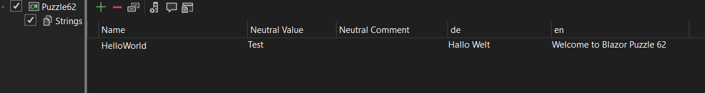
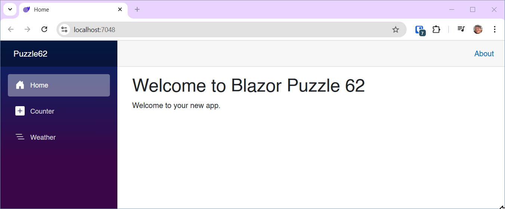
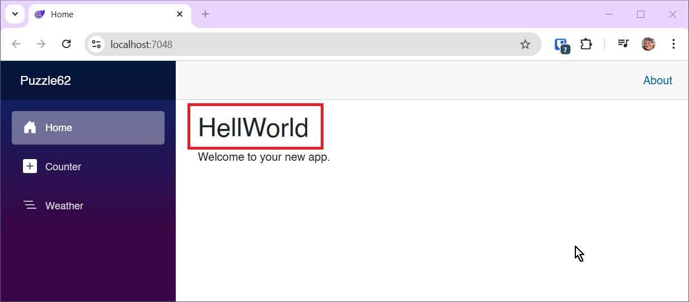

# Blazor Puzzle #62

## Look, Ma! No Magic Strings

YouTube Video: https://youtu.be/bTCMc1ckYa8

Blazor Puzzle Home Page: https://blazorpuzzle.com

### The Challenge:

Here we have a Blazor Web App with Global Server Interactivity

We've added a Resources folder with translation resources for English and German.

*Resources/Strings.cs/Strings.en.resx*:



The problem is, that we using a magic string when accessing the Localizer by key.

*Home.razor*:

```c#
@page "/"
@using Microsoft.Extensions.Localization
@inject IStringLocalizer<Strings> Localizer
@rendermode @(new InteractiveServerRenderMode(false))

<PageTitle>Home</PageTitle>

<h1>@Localizer["HelloWorld"]</h1>

Welcome to your new app.
```

Run the app and notice that the string "Welcome to Blazor Puzzle 62" from `@Localizer["HelloWorld"]` shows correctly:



But what happens if we fudge the magic "HelloWorld" key string. Change it to "HellWorld", which might be a common typo:

```c#
@page "/"
@using Microsoft.Extensions.Localization
@inject IStringLocalizer<Strings> Localizer
@rendermode @(new InteractiveServerRenderMode(false))

<PageTitle>Home</PageTitle>

<h1>@Localizer["HellWorld"]</h1>

Welcome to your new app.
```



It compiles. It doesn't throw an exception at runtime, it just quietly shows you the key name because the item in the Localizer doesn't exist.

How can we make this less brittle?

See the Solution folder for the answer