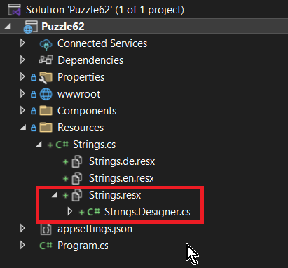

# Blazor Puzzle #62

## Look, Ma! No Magic Strings

YouTube Video: https://youtu.be/bTCMc1ckYa8

Blazor Puzzle Home Page: https://blazorpuzzle.com

### The Challenge:

Here we have a Blazor Web App with Global Server Interactivity

We've added a Resources folder with translation resources for English and German.

*Resources/Strings.cs/Strings.en.resx*:


The problem is, that we using a magic string when accessing the Localizer by key.

*Home.razor*:

```c#
@page "/"
@using Microsoft.Extensions.Localization
@inject IStringLocalizer<Strings> Localizer
@rendermode @(new InteractiveServerRenderMode(false))

<PageTitle>Home</PageTitle>

<h1>@Localizer["HelloWorld"]</h1>

Welcome to your new app.
```

Run the app and notice that the string "Welcome to Blazor Puzzle 62" from `@Localizer["HelloWorld"]` shows correctly:


But what happens if we fudge the magic "HelloWorld" key string. Change it to "HellWorld", which might be a common typo:

```c#
@page "/"
@using Microsoft.Extensions.Localization
@inject IStringLocalizer<Strings> Localizer
@rendermode @(new InteractiveServerRenderMode(false))

<PageTitle>Home</PageTitle>

<h1>@Localizer["HellWorld"]</h1>

Welcome to your new app.
```


It compiles. It doesn't throw an exception at runtime, it just quietly shows you the key name because the item in the Localizer doesn't exist.

How can we make this less brittle?

### The Solution:

Add the following to *Puzzle62.csproj*:

```xml
	<!-- Add this to enable the code generator -->
	<!-- Comment out the code in Resources\Strings.cs to make it work -->
	<ItemGroup>
		<Compile Update="Resources\Strings.Designer.cs">
			<DesignTime>True</DesignTime>
			<AutoGen>True</AutoGen>
			<DependentUpon>Strings.resx</DependentUpon>
		</Compile>
	</ItemGroup>

	<ItemGroup>
		<EmbeddedResource Update="Resources\Strings.resx">
			<Generator>ResXFileCodeGenerator</Generator>
			<LastGenOutput>Strings.Designer.cs</LastGenOutput>
		</EmbeddedResource>
	</ItemGroup>
```

The entire file should look like this:

```xml
<Project Sdk="Microsoft.NET.Sdk.Web">

	<PropertyGroup>
		<TargetFramework>net9.0</TargetFramework>
		<Nullable>enable</Nullable>
		<ImplicitUsings>enable</ImplicitUsings>
	</PropertyGroup>

	<ItemGroup>
		<PackageReference Include="Microsoft.Extensions.Localization" Version="9.0.0" />
	</ItemGroup>

	<!-- Add this to enable the code generator -->
	<!-- Comment out the code in Resources\Strings.cs to make it work -->
	<ItemGroup>
		<Compile Update="Resources\Strings.Designer.cs">
			<DesignTime>True</DesignTime>
			<AutoGen>True</AutoGen>
			<DependentUpon>Strings.resx</DependentUpon>
		</Compile>
	</ItemGroup>

	<ItemGroup>
		<EmbeddedResource Update="Resources\Strings.resx">
			<Generator>ResXFileCodeGenerator</Generator>
			<LastGenOutput>Strings.Designer.cs</LastGenOutput>
		</EmbeddedResource>
	</ItemGroup>

</Project>
```

Save the file, and notice you have a new file under *Resources/Strings.cs/Strings.resx* called *Strings.Designer.cs*:



This file was generated from the resource files, and provides a class containing properties named for the keys in the resource file.

#### Comment out Strings.cs

The only reason we had a *Strings.cs* is so we could reference a class for the localizer:

```c#
@inject IStringLocalizer<Strings> Localizer
```

`Strings` is there as a key to find the resource files. We no longer need any code in it. Just comment it out:

*Strings.cs*:

```c#
//namespace Puzzle62.Resources;

//public class Strings
//{

//	// dummy class to help generate resources

//}
```

Now we can use the Strings class directly!

*Home.razor*:

```html
@page "/"
@rendermode @(new InteractiveServerRenderMode(false))

<PageTitle>Home</PageTitle>

<h1>@Strings.HelloWorld</h1>

Welcome to your new app.
```

Now the compiler will ensure the keys are correct because they are now properties of a class!


Boom!